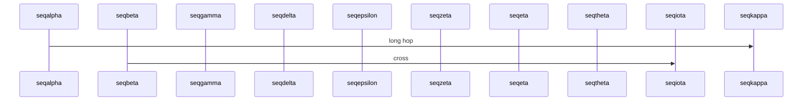
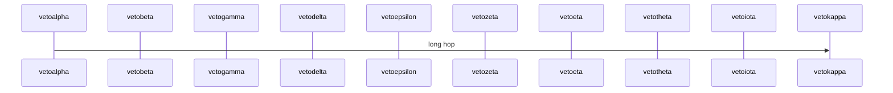

# 조경 문

첫 번째 제목 아래 소개.

## Negative: 스크린 샷은 초상화 유지

## Positive: alt-hinted 넓은 이미지 승진

## Positive: 지시어는 작은 이미지를 강제한다.

{page=landscape}

## Positive: 넓은 다이어그램 자동 프로토 타입

## Negative: 지시는 넓은 도표를 vetoes

닫기 텍스트.
